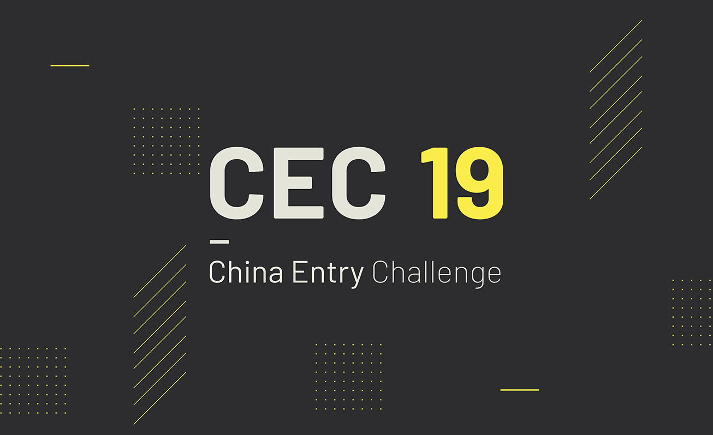
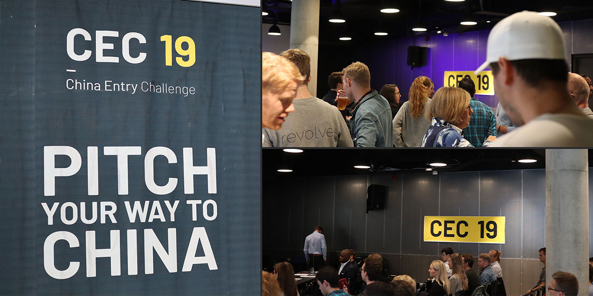
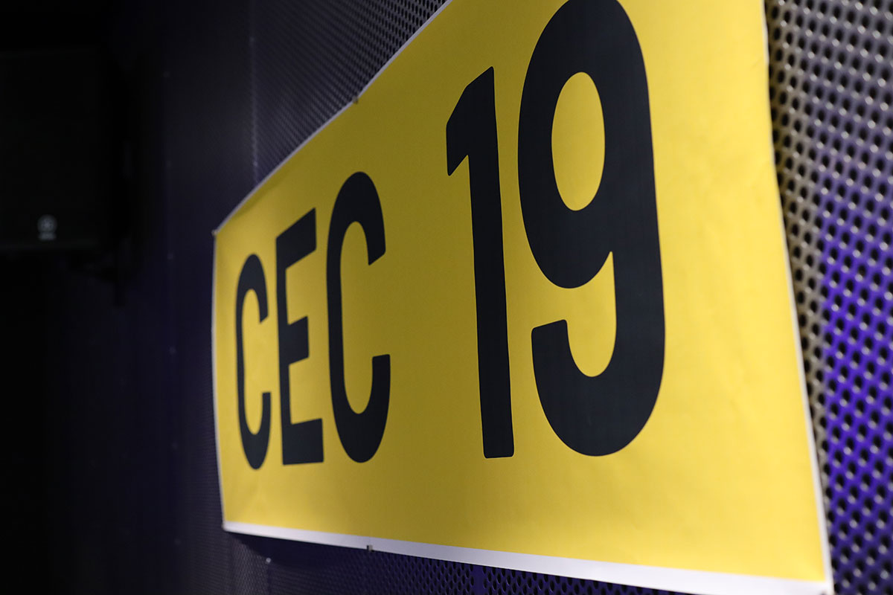
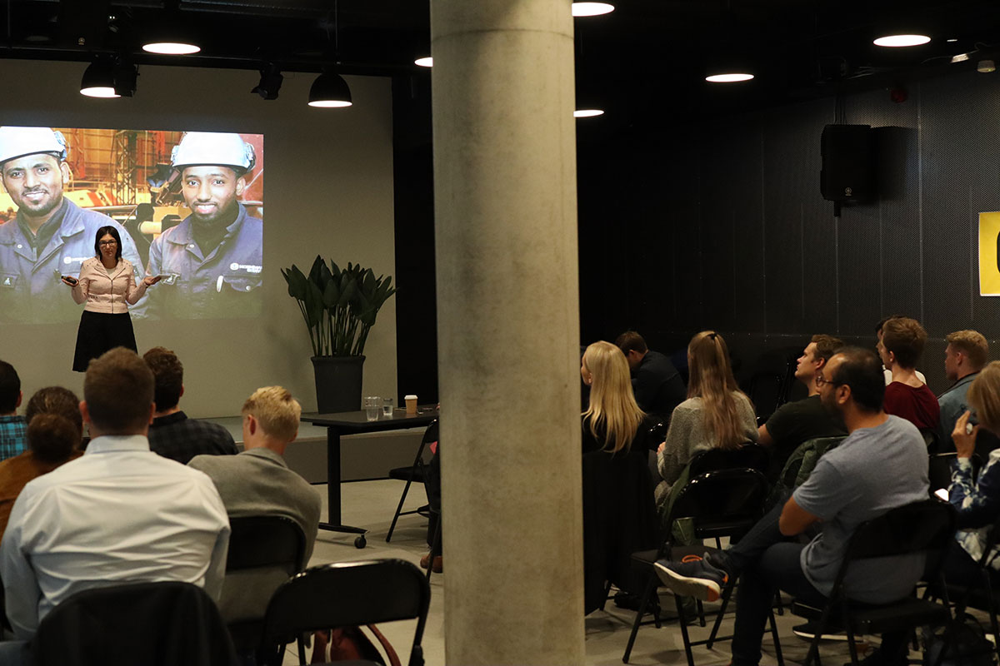
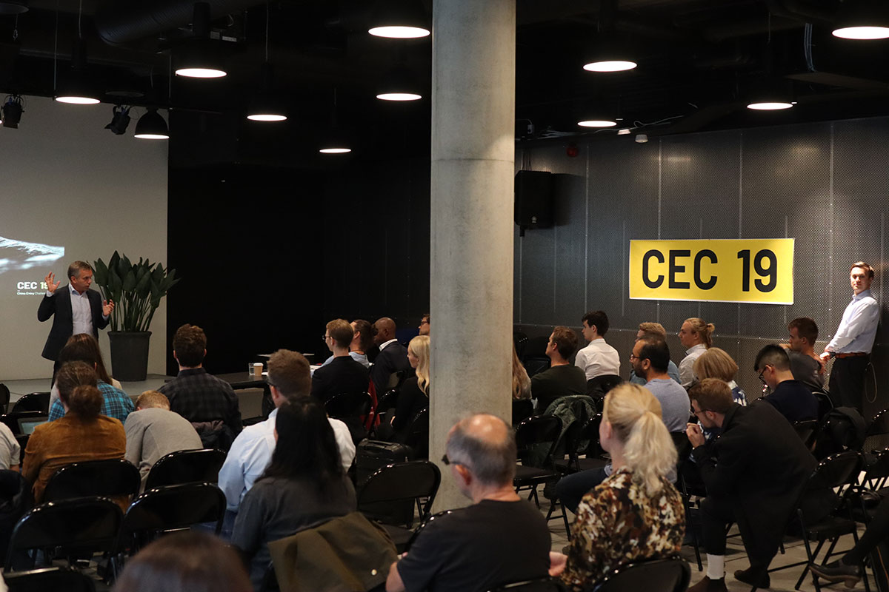

### Prosjektbeskrivelse

Oppgaven for dette prosjektet var å utforme en komplett visuell merkevareidentitet for en norsk gründerkonferanse. Idéen var å lage en konferanseidentitet som var fundamentert i koblingen mellom Norge og Kina, samtidig som identiteten fokuserer på oppstartsbedrifter. Under China Entry Challenge skal Norges ypperste oppstartsbedrifter konkurrere om å vinne ettertraktede premier.

#### Om China Entry Challenge

Det kinesiske markedet ekspanderer og oppstartsbedrifters forbindelse til markedet blir stadig mer og mer verdifullt. Kina vil overta overta plassen til USA som verdens største detaljhandelmarked i 2019, i følge en ny markedsrapport utgitt av undersøkelsesbyrået eMarketer. China Entry Challenge introduserer voksende oppstartsbedrifter til det kinesiske markedet og oppfordrer de til å ta det neste store skrittet ved å gi deltakerne invitasjon til det beryktede start-up programmet China Start i regi av CKGSB.

#### Pitchekonkurranse

Over 20 kvalifiserte oppstartsbedrifter som konkurrerer for en inngang til det kinesiske markedet gjennom en spennende kveld som inkluderer en pitchekonkurranse. oppstartsbedriftene presenterer sin idé og forretningsmodell på en scene foran innflytelsesrike investorer og publikum. Et anerkjent dommerpanel av sponsorer og partnere vil evaluere presentasjonene og rangere oppstartsbedriftene. De beste kandidatene vinner sponsormidler til CKGSBs gründerprogram China Start. Et oppslukende program for oppstartsbedrifter og vekstbedrifter for å lære mer om det kinesiske markedet og knytte forbindelser med kinesiske investorer.

