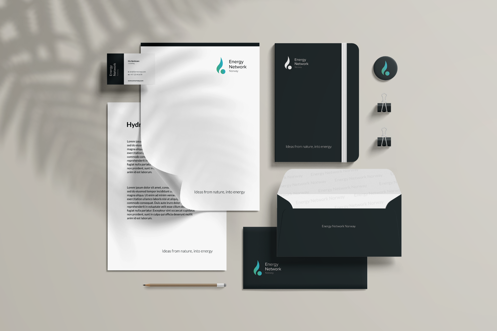
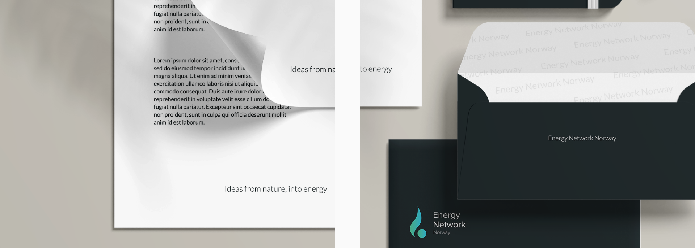
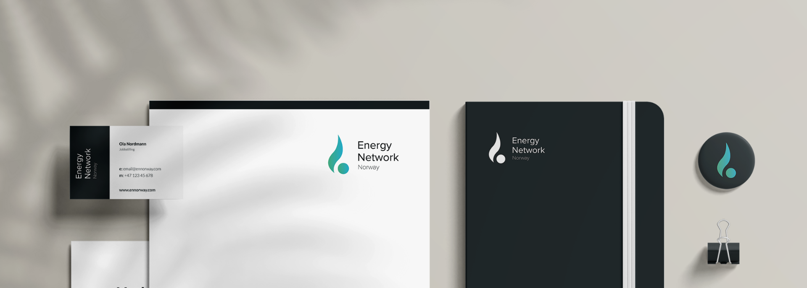
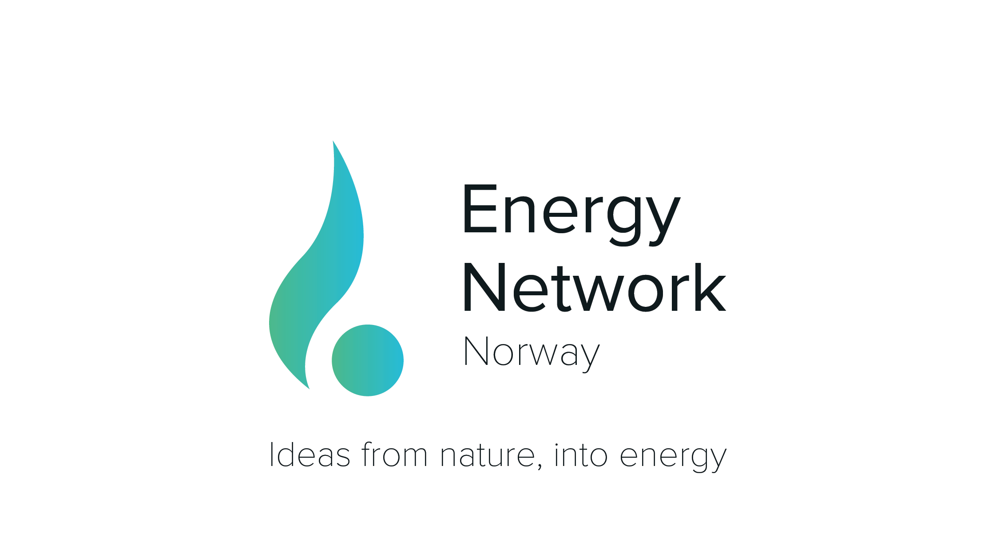

### Project Description

The goal of the project was to create a logo that Energy Network Norway can use to further develop its profile. The desired effect was to create a modern logo that symbolizes a network of green solutions for the future.

#### About Energy Network Norway

Energy Network Norway operates as a think tank for creating and presenting new business opportunities to the LNG, Hydrogen and Hybrid sectors and acts as an enabler between product and services companies and governmental bodies.

