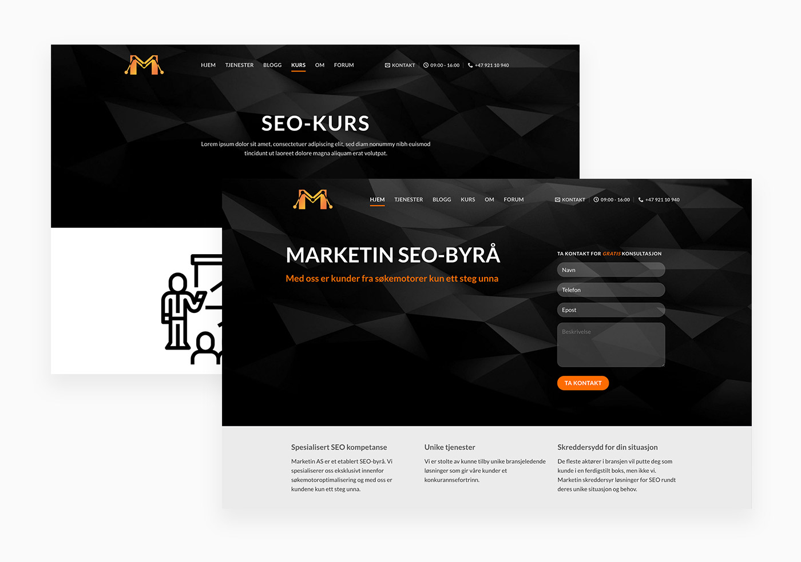
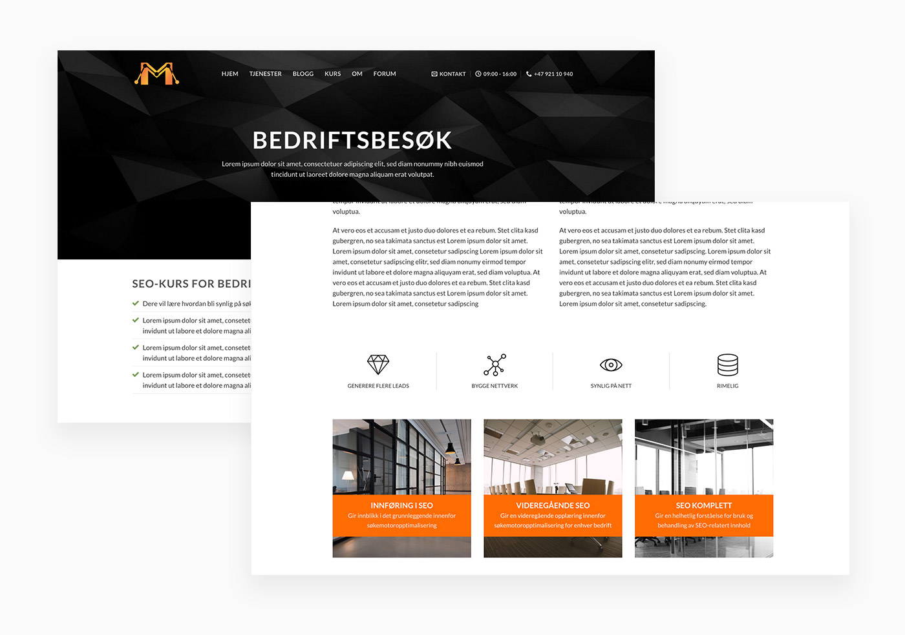
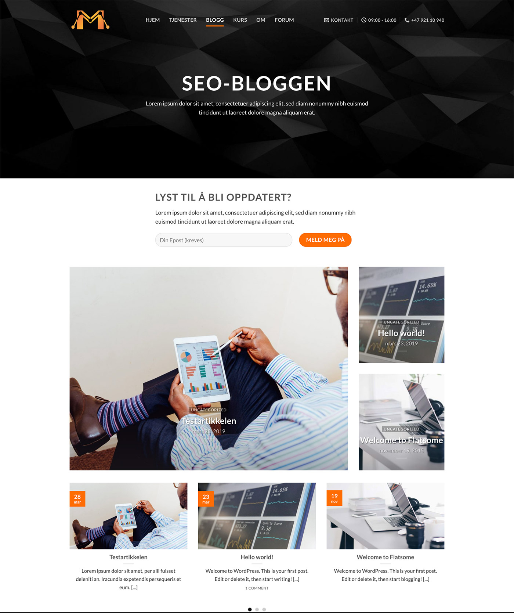

### Project Description

This project involved designing a complete website for the marketing agency Marketin. Visibility and logical structure of the website is absolutely essential for an SEO agency, so the structure and different sections became important in this project.

#### About Marketin

Marketin is a small independent marketing agency founded in early 2019. Marketin aims to be a more convenient, agile and popular agency that helps midsize to large companies achieve higher profitability through search engine optimization.

