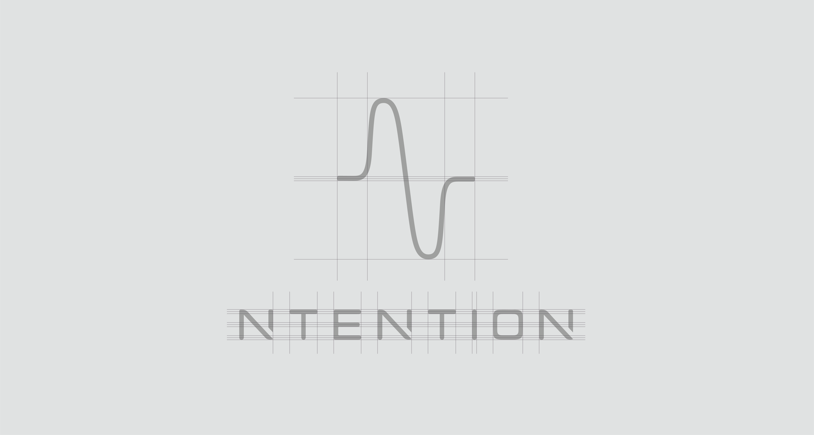
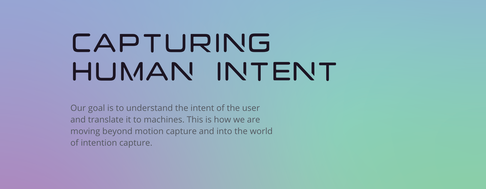
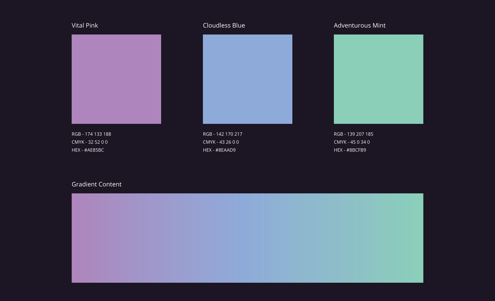

### Project Description

The task for this project was to design a complete brand identity for the Norwegian start-up Ntention. Ntention works with innovative technology in human-machine interaction and this is exactly what should be emphasized in the identity. The brand needed to be something dynamic and breathing.

#### About Ntention

Ntention is a Norwegian technology company originating from NTNU in Trondheim. The company develops systems to make interaction and communication with machines easier and more intuitive. In a short time, the company has developed groundbreaking technology for the use of natural hand movements in VR for industry and has an ongoing research project with NASA partners for the development of interaction systems in spacesuits.

#### Logo Design

The logo design is simple, distinctive and gives a feeling of dynamic movement. Consistent use in conjunction with other content makes it instantly recognizable in all sizes and formats. A graphic element in its simplest form, a line, yet it breath
and move like a complex element of brain signals.

#### Color Palette

The primary brand colors are Vital Pink, Cloudless Blue and Adventurous Mint. The combination forms a range of colors with different degrees of gradient.

