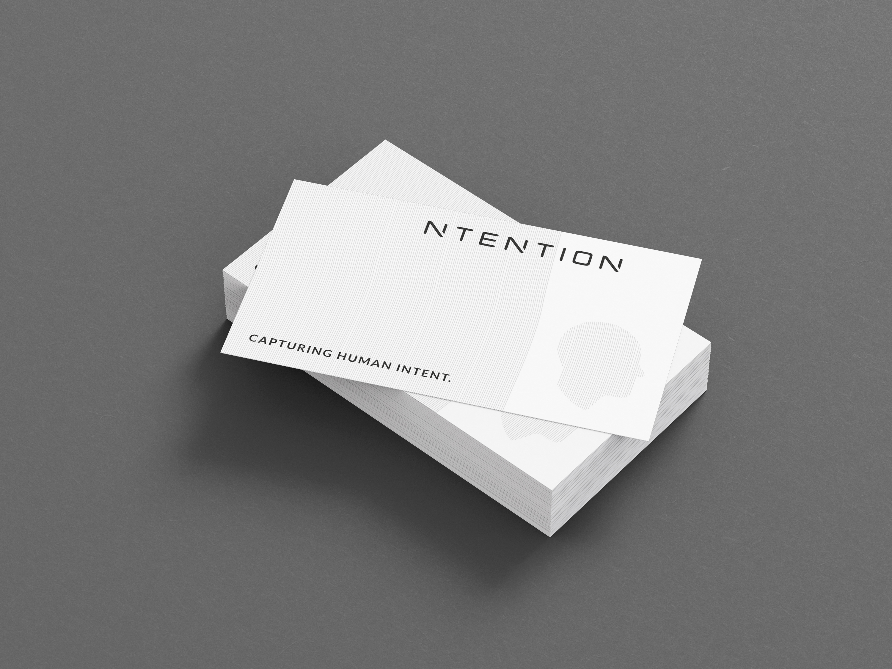
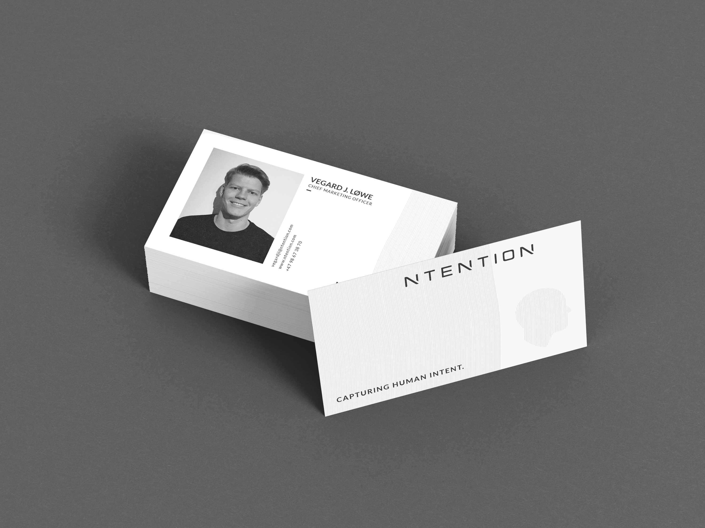
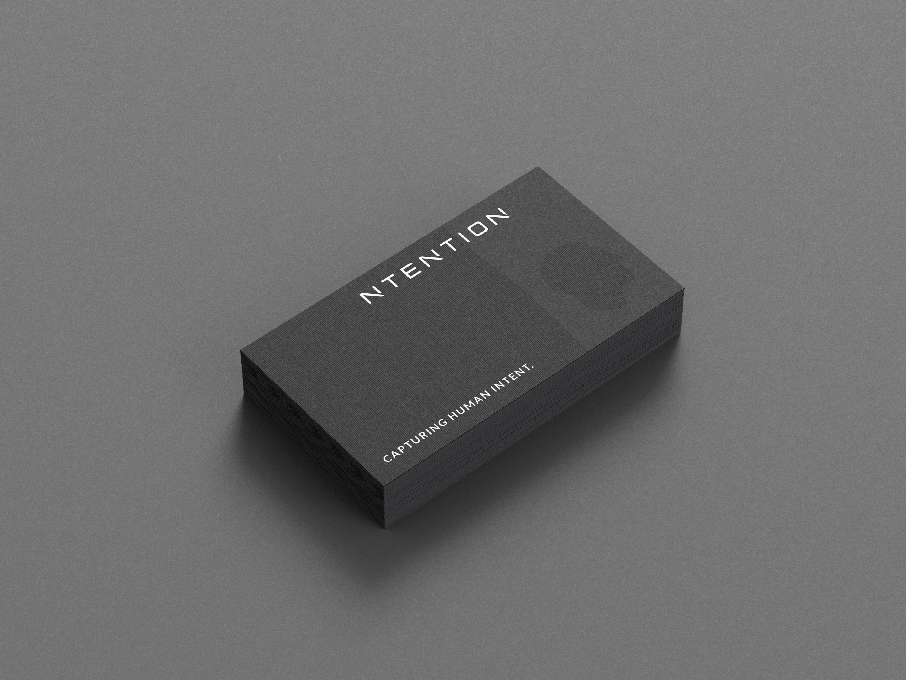

### Project Description

The task for this project was to design business cards for the Norwegian start-up Ntention. Ntention works with innovative technology within human-machine interaction and it is precisely this communication that should be prominent in the design of the business cards. Other important key hooks for the design are mysterious, simple and professional.

#### About Ntention

Ntention is a Norwegian technology company originating from NTNU in Trondheim. The company develops systems to make interaction and communication with machines easier and more intuitive. In a short time, the company has developed groundbreaking technology for the use of natural hand movements in VR for industry and has an ongoing research project with NASA partners for the development of interaction systems in spacesuits.

