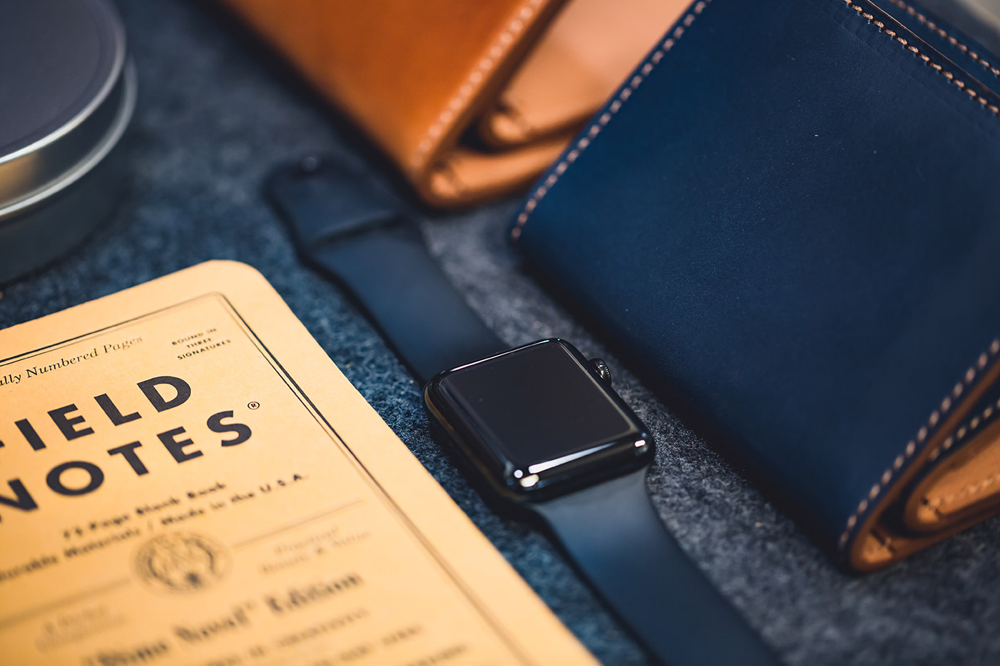
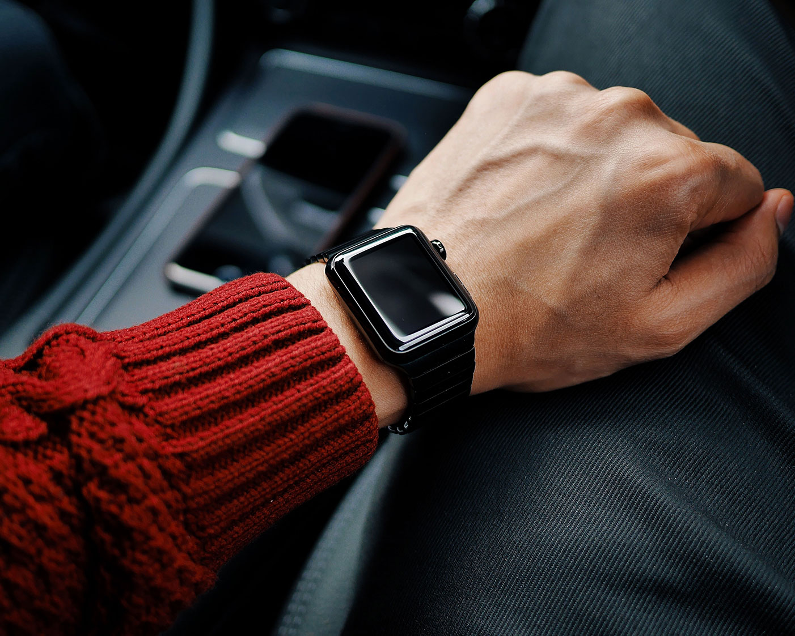
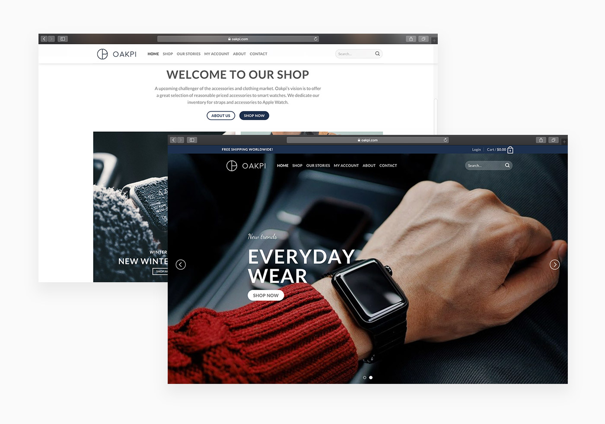
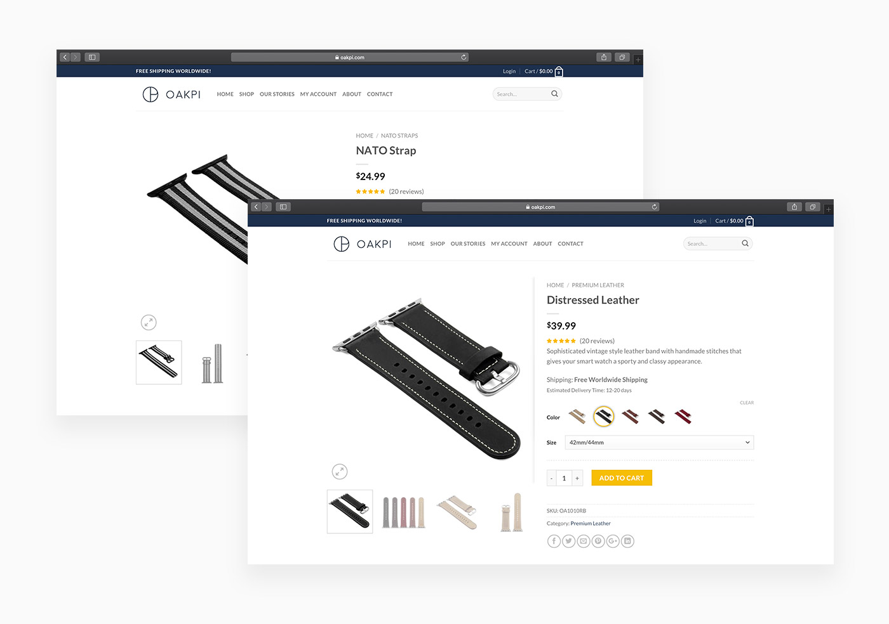

### Project Description

The task of this project was to design a complete brand identity for an international online store specializing in accessories for the Apple Watch. Important core characteristics of the brand are quality, openness and harmony.

#### About Oakpi

Oakpi is an online store that aims to become a challenger to the Apple Watch accessories market. Genuine Apple Watch accessories are overpriced and customers pay large sums only for the brand. You can easily produce the same products with exactly the same material at a significantly lower cost. This way of thinking is the foundation of Oakpi's vision. By offering high quality products at a reasonable price, Oakpi plays on the customer's team.

#### Logo Design

A stylish logo was designed that expresses the exclusivity of the brand.

<iframe src="https://player.vimeo.com/video/317268097" width="640" height="360" frameborder="0" allow="autoplay; fullscreen" allowfullscreen></iframe>

#### Website

The identity was passed on to the expression in all parts of the website. Everything from components to animations safeguards the quality of the brand.

