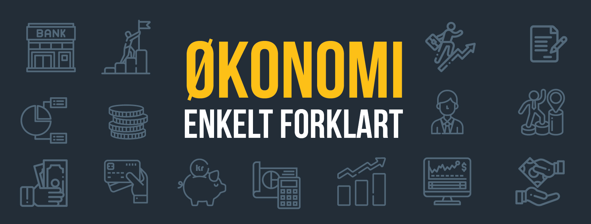
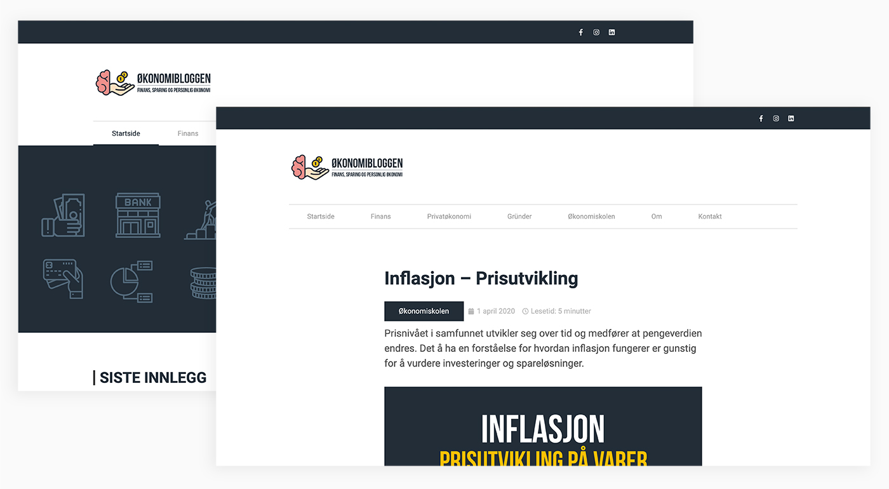
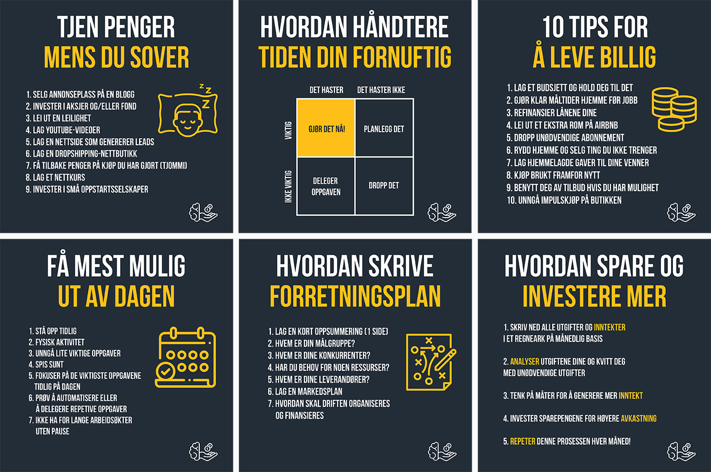

### Prosjektbeskrivelse

Oppgaven for dette prosjektet var å utforme en komplett visuell merkevareidentitet for en norsk nettbasert økonomiblogg. Identiteten består av logodesign, fargepalett, typografi og designelementer for bruk i sosiale medier. I tillegg ble det designet og utviklet et nettsted som er et samlested for alle artikler fra Økonomibloggen. Det var særlig viktig å få frem økonomiske begrep på en visuell måte slik at artiklene oppleves lettleste og engasjerende.

#### Om Økonomibloggen

Økonomibloggen er et nyoppstartet nettsted innen økonomi. Nettstedet har som mål å hjelpe deg forstå komplekse finansielle konsepter, forbedre investerings-ferdigheter, og å lære deg å håndtere penger i det hverdagslige livet. Artiklene som blir publisert på bloggen er innenfor feltene personlig økonomi, finans og innovasjon.

#### Logodesign

Det ble utformet en merkevareidentitet med logo som uttrykker formidling, kompetanse og økonomi. Logodesignet kombinerer derfor elementene hånd, hjerne og mynter for å uttrykke dette budskapet.

