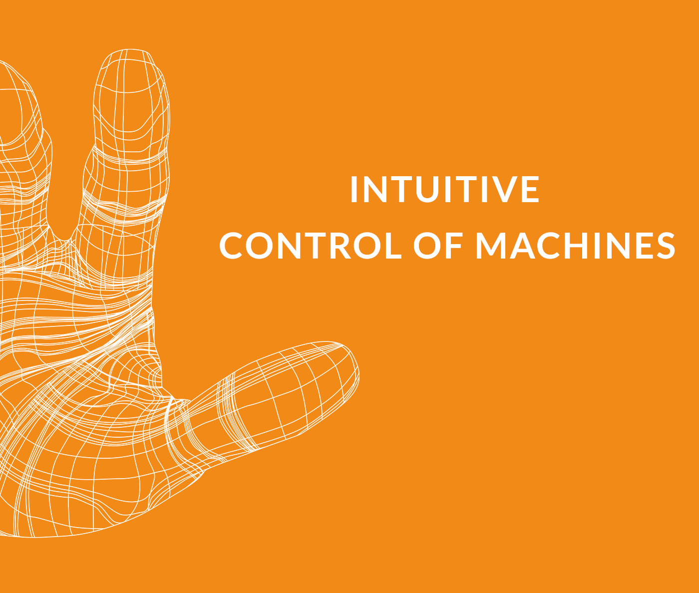
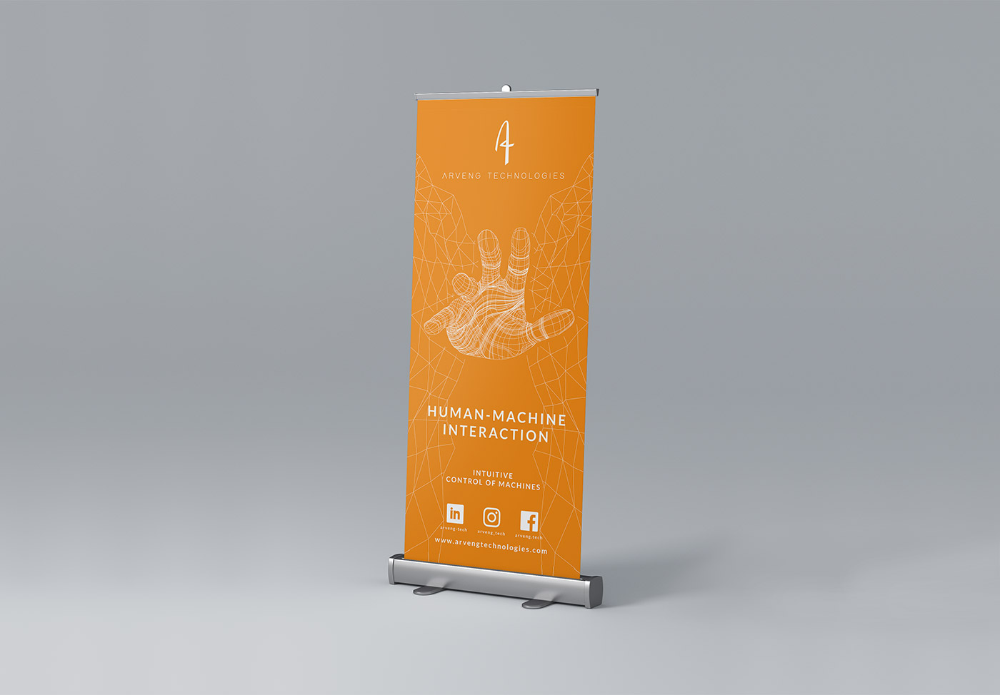
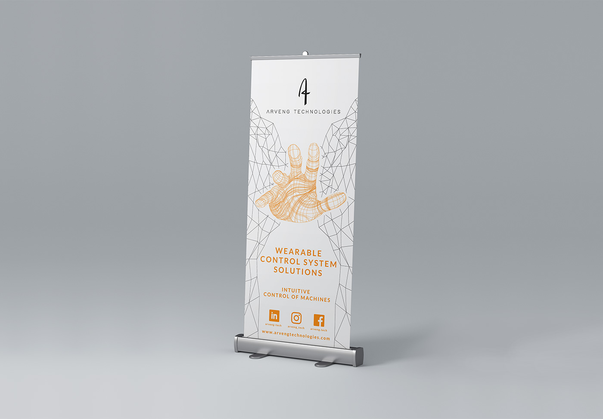

### Prosjektbeskrivelse

Dette prosjektet gikk ut på å designe reklameartikler og roll-up for teknologiselskapet Arveng Technologies. Reklameartiklene vil bli brukt på konferanser og internasjonale teknologisamlinger.

#### Om Arveng Technologies

Arveng Technologies lager en hanske med sensorer på hver finger for å kartlegge bevegelsen av hånden. Dataen blir brukt til å konstruere en 3D-modell av hånden, som vil gjenkjenne ulike håndgester og utgjøre fundamentet som kan brukes til å kontrollere maskiner. På denne måten vil kapasiteten som kreves av brukeren minimeres.

