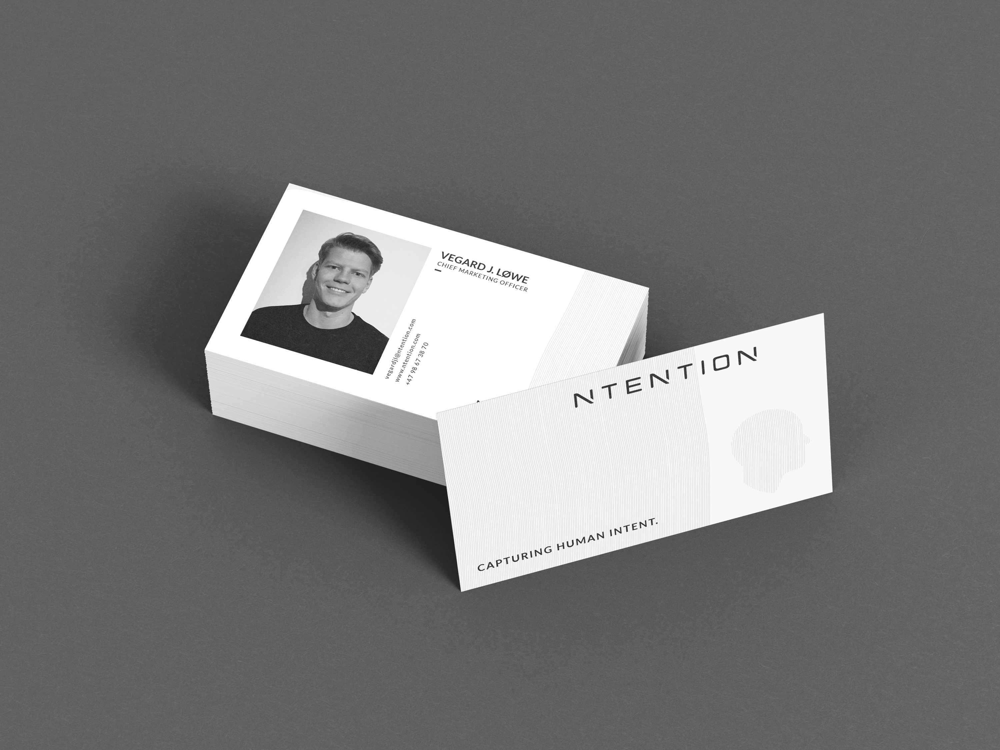
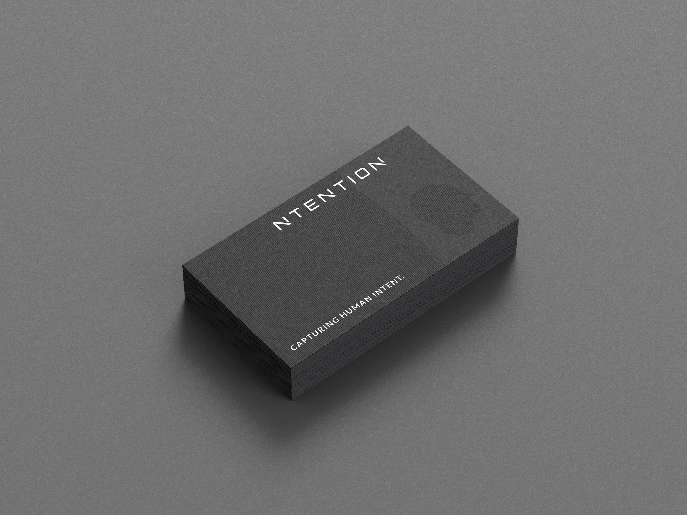

### Prosjektbeskrivelse

Oppgaven for dette prosjektet var å utforme design for visittkort for den norske oppstartsbedriften Ntention. Ntention arbeider med innovativ teknologi innen menneske-maskin-interaksjon og det er nettopp denne kommunikasjonen som skulle være fremtredende i designet av visittkort. Andre viktige nøkkelknagger for designet er mystisk, enkel og profesjonell.

#### Om Ntention

Ntention er et norsk teknologiselskap med utspring fra NTNU i Trondheim. Selskapet utvikler systemer for å gjøre interaksjon og kommunikasjon med maskiner enklere og mer intuitivt. På kort tid har selskapet utviklet banebrytende teknologi for bruk av naturlige håndbevegelser i VR for industri og har et pågående forskningsprosjekt med NASA-partnere for utvikling av interaksjonssystemer i romdrakter.

