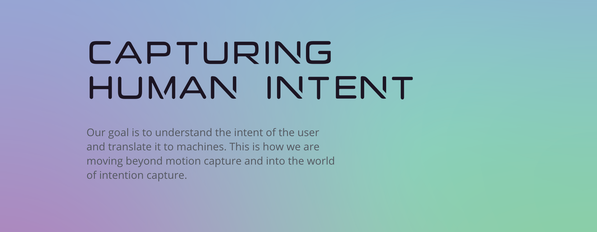

### Prosjektbeskrivelse

Oppgaven for dette prosjektet var å utforme komplett visuell identitet for den norske oppstartsbedriften Ntention. Ntention arbeider med innovativ teknologi innen menneske-maskin-interaksjon og det er nettopp dette som skulle fremheves i identiteten.

#### Om Ntention

Ntention er et norsk teknologiselskap med utspring fra NTNU i Trondheim. Selskapet utvikler systemer for å gjøre interaksjon og kommunikasjon med maskiner enklere og mer intuitivt. På kort tid har selskapet utviklet banebrytende teknologi for bruk av naturlige håndbevegelser i VR for industri og har et pågående forskningsprosjekt med NASA-partnere for utvikling av interaksjonssystemer i romdrakter.

#### Logodesign

Logodesignet er enkelt, særegent og gir en følelse av dynamisk bevegelse. Konsekvent bruk i sammenheng med annet innhold gjør den umiddelbart gjenkjennelig i alle størrelser og format.

#### Fargepalett

De primære merkevarefargene er Vital Pink, Cloudless Blue og Adventurous Mint. Kombinasjonen utgjør et spekter av farger med ulik grad av gradient.

